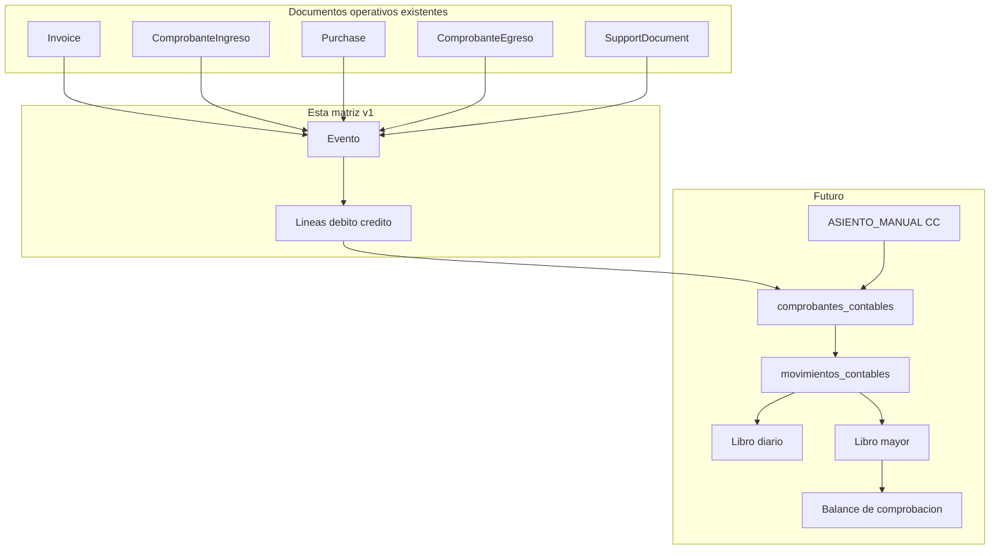

# Matriz de eventos contables — Centradia (v1)

> **Estado del documento:** especificación funcional lista para revisión del contador.  
> **Alcance:** primera cobertura operativa (ventas, cobros, compras, pagos, ingresos/egresos, anulaciones).  
> **Fuera de alcance v1:** nómina, depreciaciones, cierres de ejercicio, facturación electrónica DIAN completa, centros de costo avanzados.  
> **Motor de asientos:** núcleo manual CC implementado (`comprobantes_contables` / `movimientos_contables`). Esta matriz sigue siendo el contrato previo para automatizar documentos operativos.

## Cómo leer este documento

Hay **tres secciones** que trabajan juntas:

1. **Eventos** — qué pasa en el negocio y cuándo debe nacer el asiento.
2. **Líneas** — qué débitos/créditos produce cada evento (una fila = un movimiento).
3. **Casos de prueba** — números concretos para validar que el asiento cuadra.

Estados de aprobación por evento:

| Estado | Significado |
|---|---|
| `PROPUESTO` | Líneas sugeridas por ingeniería + práctica contable colombiana; pendientes de firma del contador |
| `OBSERVADO` | El contador pidió cambios |
| `APROBADO_CONTADOR` | Listo para implementar en el motor |
| `BLOQUEADO` | No se puede automatizar hasta resolver un hueco de configuración o de producto |

---

## 0. Inventario de eventos operativos (Centradia hoy)

Fuentes: `VentaService`, `InvoiceService`, `AccountReceivableService`, `ComprobanteIngresoService`, `PurchaseService`, `AccountPayableService`, `ComprobanteEgresoService`, `InventarioService`, `SupportDocumentService`, `docs/CONTABILIDAD_PLAN_CUENTAS.md`.

| Código evento | Disparador actual | Documento origen | Tipo comprobante futuro | ¿Existe flujo operativo? | ¿Genera asiento hoy? |
|---|---|---|---|---|---|
| `VENTA_CONTADO` | `VentaService::registrarVentaContado` | `Invoice` PAID + `ComprobanteIngreso` PAGO_FACTURA | FV (+ RC implícito o asiento conjunto) | Sí | No |
| `VENTA_CREDITO` | `VentaService::ventaACredito` | `Invoice` PENDING + `AccountReceivable` | FV | Sí | No |
| `COBRO_CARTERA` | `ComprobanteIngresoService::crearComprobante` (con aplicaciones) | `ComprobanteIngreso` COBRO_CUENTA | RC | Sí | No |
| `INGRESO_MANUAL` | `ComprobanteIngresoService::crearComprobante` (sin factura/aplicaciones) | `ComprobanteIngreso` INGRESO_MANUAL | RC o CC | Sí | No |
| `COMPRA_CREDITO` | `PurchaseService::aprobarCompra` (crédito) | `Purchase` APROBADO + `AccountPayable` | FC | Sí | No |
| `COMPRA_CONTADO` | `PurchaseService::aprobarCompra` (contado) | `Purchase` + CxP + `ComprobanteEgreso` | FC (+ RP) | Sí | No |
| `PAGO_PROVEEDOR` | `ComprobanteEgresoService::crearComprobante` / `AccountPayableService::registrarPago` | `ComprobanteEgreso` PAGO_CUENTA | RP | Sí | No |
| `GASTO_DIRECTO` | `ComprobanteEgresoService::crearComprobante` (concepto) | `ComprobanteEgreso` GASTO_DIRECTO | RP o CC | Sí | No |
| `CXP_MANUAL` | `AccountPayableService::registrarCuentaPorPagarManual` | `AccountPayable` SOURCE_MANUAL | CC o FC | Sí | No |
| `EGRESO_ANULAR` | `ComprobanteEgresoService::anularComprobante` | CE revertido + CI de reverso | RP/CC reverso | Sí | No |
| `DOCSOPORTE_CONTADO` | `SupportDocumentService::aprobarDocumento` + CE | `SupportDocument` + CE | FC/RP (DSE) | Sí | No |
| `DOCSOPORTE_CREDITO` | `SupportDocumentService::aprobarDocumento` | `SupportDocument` | FC | Parcial (sin CxP) | No |
| `FACTURA_ANULAR` | `InvoiceService::anularFactura` | `Invoice` VOID | NC / reverso FV | Parcial (solo estado) | No |
| `DEVOLUCION_VENTA` | *(no implementado)* | Nota crédito / ajuste | NC | No | No |
| `ASIENTO_MANUAL` | `AsientoContableService` | `ComprobanteContable` + movimientos | CC | Sí | Sí |

### Notas de inventario relevantes

- El **costo de venta** debe tomarse de `MovimientoInventario` (`unit_cost × quantity` por `invoice_id`), no de `Product.cost`.
- Los bolsillos ya tienen `cuenta_contable_id` (grupo 11).
- Los productos ya tienen `categoria_contable_id` → inventario / costo / ingreso / devolución.
- **Faltan cuentas de configuración:** clientes (CxC), proveedores (CxP), IVA generado, IVA descontable, retenciones, descuentos, gastos por destino, activos fijos.
- Anular factura hoy **no** revierte inventario, caja ni cartera. La matriz exige un reverso completo cuando se implemente el motor.

---

## 1. Sección EVENTOS

### Leyenda de columnas

| Columna | Significado |
|---|---|
| Código | Identificador estable del evento |
| Momento | Instantánea exacta en que nace el asiento |
| Condiciones | Filtros que activan el escenario |
| Tercero | Quién va en el asiento / líneas |
| Efecto operativo actual | Qué hace Centradia hoy (caja, stock, cartera) |
| Reversión | Cómo se corrige |
| Cuentas resueltas / faltantes | Fuente de cada cuenta |
| Estado | Aprobación del contador |

### 1.1 Ventas y cobros

| Código | Nombre | Documento origen | Momento | Condiciones | Tercero | Efecto operativo actual | Reversión | Estado |
|---|---|---|---|---|---|---|---|---|
| `VENTA_CONTADO` | Venta de producto/servicio pagada al instante | `Invoice` PAID (+ CI PAGO_FACTURA) | Al confirmar venta con destinos de bolsillo | `status=PAID`; hay al menos un destino; líneas producto y/o suscripción | Cliente (`invoice.tercero_id`) | Baja inventario FIFO; crea CI; sube bolsillo(s); puede crear suscripción | Reverso completo: inventario, caja, asiento (hoy no existe) | `PROPUESTO` |
| `VENTA_CREDITO` | Venta a crédito / cuenta por cobrar | `Invoice` PENDING + `AccountReceivable` | Al confirmar venta con cuotas | `status=PENDING`; cuotas suman el total | Cliente | Baja inventario; crea CxC + cuotas; **no** mueve caja | Reverso: stock + CxC + asiento | `PROPUESTO` |
| `COBRO_CARTERA` | Recaudo de cuenta por cobrar | `ComprobanteIngreso` COBRO_CUENTA | Al registrar cobro con aplicaciones | Hay `aplicaciones` a CxC; montos > 0 | Cliente de la CxC | Sube bolsillo; baja balance CxC/cuotas; puede marcar factura PAID | Reverso CI (hoy campos existen, flujo no) | `PROPUESTO` |
| `INGRESO_MANUAL` | Ingreso de caja sin factura | `ComprobanteIngreso` INGRESO_MANUAL | Al crear CI sin factura ni aplicaciones | Sin `invoice_id` ni aplicaciones | Opcional | Solo sube bolsillo(s) | Reverso CI | `PROPUESTO` / `BLOQUEADO` parcial: falta cuenta de contrapartida (ingreso/gasto/pasivo) configurable |

### 1.2 Compras y pagos

| Código | Nombre | Documento origen | Momento | Condiciones | Tercero | Efecto operativo actual | Reversión | Estado |
|---|---|---|---|---|---|---|---|---|
| `COMPRA_CREDITO` | Aprobación de compra a crédito | `Purchase` APROBADO + `AccountPayable` | Al aprobar compra no contado | Compra en borrador → aprobado; no liquida caja | Proveedor (`purchase.tercero_id`) | Entrada inventario/activos; crea CxP | No hay anulación de compra aprobada | `PROPUESTO` |
| `COMPRA_CONTADO` | Aprobación de compra pagada al instante | `Purchase` + CxP + CE | Al aprobar compra contado | `payment_type` contado; hay orígenes de bolsillo | Proveedor | Entrada inventario/activos; CxP; CE liquida CxP y baja bolsillo | Compra no reversible; CE sí se anula | `PROPUESTO` |
| `PAGO_PROVEEDOR` | Abono a cuenta por pagar | `ComprobanteEgreso` PAGO_CUENTA | Al pagar CxP (parcial/total) | Destinos con `account_payable_id` | Proveedor / acreedor | Baja bolsillo; baja balance CxP; puede marcar compra PAGADO | `EGRESO_ANULAR` | `PROPUESTO` |
| `GASTO_DIRECTO` | Egreso por concepto (sin CxP) | `ComprobanteEgreso` GASTO_DIRECTO | Al crear egreso con concepto | Destinos con texto `concepto` | Opcional | Solo baja bolsillo | `EGRESO_ANULAR` | `BLOQUEADO` hasta amarrar `cuenta_gasto_id` por destino |
| `CXP_MANUAL` | Causación de deuda sin compra | `AccountPayable` SOURCE_MANUAL | Al registrar CxP manual | Fuente manual | Acreedor | Solo crea pasivo operativo | No hay anulación CxP | `BLOQUEADO` hasta amarrar cuenta de contrapartida (gasto/servicio) |
| `EGRESO_ANULAR` | Anulación / reverso de egreso | CE revertido + CI reverso | Al anular CE (sesión abierta) | CE no revertido; sesión de caja abierta | Mismo del CE | Reingresa bolsillo; restaura CxP | N/A (ya es reverso) | `PROPUESTO` |

### 1.3 Documento soporte

| Código | Nombre | Documento origen | Momento | Condiciones | Tercero | Efecto operativo actual | Reversión | Estado |
|---|---|---|---|---|---|---|---|---|
| `DOCSOPORTE_CONTADO` | Aprobación DSE pagado | `SupportDocument` + CE gasto directo | Al aprobar con pago | Contado; líneas inventario/servicio | Proveedor | Entrada stock (simples); CE baja bolsillo | Anular solo borrador; CE anulable | `PROPUESTO` / revisar modelo (hoy CE = gasto directo, no CxP) |
| `DOCSOPORTE_CREDITO` | Aprobación DSE a crédito | `SupportDocument` | Al aprobar sin pago | Crédito | Proveedor | Solo entrada stock; **no crea CxP** | Sin reverso de aprobación | `BLOQUEADO` — hay que crear CxP operativa antes de automatizar |

### 1.4 Anulaciones / devoluciones / manual

| Código | Nombre | Documento origen | Momento | Condiciones | Tercero | Efecto operativo actual | Reversión | Estado |
|---|---|---|---|---|---|---|---|---|
| `FACTURA_ANULAR` | Anulación de factura | `Invoice` VOID | Al anular (debe ser completo) | Factura no VOID | Cliente | Hoy solo cambia estado | Debe generar asiento inverso + reponer stock/caja/cartera | `BLOQUEADO` — completar flujo operativo primero |
| `DEVOLUCION_VENTA` | Devolución / nota crédito | NC (futuro) | Al confirmar devolución | Parcial o total | Cliente | No existe | Usar `cuenta_devolucion` + reingreso inventario | `BLOQUEADO` — no hay producto |
| `ASIENTO_MANUAL` | Comprobante contable / CC | `ComprobanteContable` | Al contabilizar CC | Líneas cuadradas; cuentas auxiliares | Opcional por línea | Borrador, contabilización e inmutabilidad | Reverso por nuevo CC | `IMPLEMENTADO` |

---

## 2. Sección LÍNEAS (matriz débito / crédito)

### Convención de orígenes de cuenta

| Origen | Significado | ¿Disponible hoy? |
|---|---|---|
| `BOLSILLO` | `bolsillo.cuenta_contable_id` (11…) | Sí |
| `CAT_INGRESO` | `product.categoria_contable.cuenta_ingreso_id` | Sí |
| `CAT_INVENTARIO` | `…cuenta_inventario_id` | Sí |
| `CAT_COSTO` | `…cuenta_costo_id` | Sí |
| `CAT_DEVOLUCION` | `…cuenta_devolucion_id` | Sí (sin flujo) |
| `CFG_CLIENTES` | Cuenta CxC de la tienda (ej. 1305 auxiliar) | **No** — falta config |
| `CFG_PROVEEDORES` | Cuenta CxP de la tienda (ej. 2205 auxiliar) | **No** — falta config |
| `CFG_IVA_GENERADO` | IVA en ventas | **No** — falta config |
| `CFG_IVA_DESCONTABLE` | IVA en compras | **No** — falta config |
| `DESTINO_GASTO` | Cuenta del destino de egreso/concepto | **No** — solo texto hoy |
| `FIJA` / `MANUAL` | Selección explícita en el asiento | Para CC |

### Fórmulas de valor

| Fórmula | Definición |
|---|---|
| `SUBTOTAL` | `invoice.subtotal` o equivalente del documento |
| `IVA` | `invoice.tax` / `tax_total` del documento |
| `DESCUENTO` | `invoice.discount` |
| `TOTAL` | Total del documento / destino / aplicación |
| `COSTO_FIFO` | Σ (`movimiento_inventario.unit_cost × quantity`) del documento |
| `MONTO_DESTINO` | Monto de un bolsillo / destino concreto |
| `MONTO_APLICACION` | Monto aplicado a una CxC |
| `MONTO_LINEA` | Valor de una línea de compra/producto |

> Si `IVA = 0` o no aplica, se omiten las líneas de IVA.  
> Si hay varios bolsillos, se genera **una línea débito/crédito por bolsillo**.  
> Si hay varias categorías contables en los productos, se **agrupan líneas** por cuenta de ingreso/costo/inventario.

---

### 2.1 `VENTA_CONTADO` → tipo FV (asiento de reconocimiento + cobro)

**Diseño recomendado v1:** un solo asiento por venta contado (evita FV+RC descuadrados). Alternativa (Siigo-like): FV reconoce CxC/ingreso/costo y RC cobra CxC; en contado se generan ambos en la misma transacción. **Pendiente decisión del contador.**

#### Opción A — Asiento único (propuesta inicial)

| Orden | Nat. | Concepto | Origen cuenta | Fórmula | Tercero en línea |
|---:|---|---|---|---|---|
| 1 | DÉBITO | Caja / banco | `BOLSILLO` | `MONTO_DESTINO` (por bolsillo) | Cliente |
| 2 | CRÉDITO | Ingresos por ventas | `CAT_INGRESO` | Σ subtotales netos por categoría | Cliente |
| 3 | CRÉDITO | IVA generado | `CFG_IVA_GENERADO` | `IVA` | Cliente / DIAN según política |
| 4 | DÉBITO | Costo de ventas | `CAT_COSTO` | `COSTO_FIFO` por categoría | — / Cliente |
| 5 | CRÉDITO | Inventarios | `CAT_INVENTARIO` | `COSTO_FIFO` por categoría | — |

**Descuento:** si `DESCUENTO > 0`, bajar el crédito de ingreso (neto) o usar cuenta de descuento (`CFG_DESCUENTO`) — **decidir con contador**.

**Servicios / suscripciones:** mismas líneas de ingreso/IVA; **omitir** 4 y 5 (sin inventario).

**Cuadra si:** `Σ débitos bolsillo = SUBTOTAL − DESCUENTO + IVA` y `COSTO_FIFO` débito = `COSTO_FIFO` crédito.

#### Opción B — Dos asientos (FV + RC)

1. FV: Dr `CFG_CLIENTES` TOTAL / Cr ingreso / Cr IVA; Dr costo / Cr inventario.  
2. RC: Dr `BOLSILLO` / Cr `CFG_CLIENTES`.

---

### 2.2 `VENTA_CREDITO` → tipo FV

| Orden | Nat. | Concepto | Origen cuenta | Fórmula | Tercero |
|---:|---|---|---|---|---|
| 1 | DÉBITO | Clientes / CxC | `CFG_CLIENTES` | `TOTAL` | Cliente |
| 2 | CRÉDITO | Ingresos | `CAT_INGRESO` | Neto por categoría | Cliente |
| 3 | CRÉDITO | IVA generado | `CFG_IVA_GENERADO` | `IVA` | Cliente |
| 4 | DÉBITO | Costo de ventas | `CAT_COSTO` | `COSTO_FIFO` | — |
| 5 | CRÉDITO | Inventarios | `CAT_INVENTARIO` | `COSTO_FIFO` | — |

**No** mueve caja. El cobro posterior es `COBRO_CARTERA`.

---

### 2.3 `COBRO_CARTERA` → tipo RC

| Orden | Nat. | Concepto | Origen cuenta | Fórmula | Tercero |
|---:|---|---|---|---|---|
| 1 | DÉBITO | Caja / banco | `BOLSILLO` | `MONTO_DESTINO` | Cliente |
| 2 | CRÉDITO | Clientes / CxC | `CFG_CLIENTES` | `MONTO_APLICACION` (total aplicaciones) | Cliente |

**No** reconoce ingreso ni costo.  
Pagos parciales: mismo esquema con el monto cobrado.

---

### 2.4 `INGRESO_MANUAL` → tipo RC o CC

| Orden | Nat. | Concepto | Origen cuenta | Fórmula | Tercero |
|---:|---|---|---|---|---|
| 1 | DÉBITO | Caja / banco | `BOLSILLO` | `MONTO_DESTINO` | Opcional |
| 2 | CRÉDITO | Contrapartida | `MANUAL` / config por motivo | `TOTAL` | Opcional |

**Bloqueo parcial:** hoy el CI no pide cuenta de contrapartida. Para automatizar hay que agregar motivo → cuenta, o forzar captura manual (equivalente a CC con movimiento de caja).

---

### 2.5 `COMPRA_CREDITO` → tipo FC

| Orden | Nat. | Concepto | Origen cuenta | Fórmula | Tercero |
|---:|---|---|---|---|---|
| 1 | DÉBITO | Inventarios / mercancía | `CAT_INVENTARIO` | `MONTO_LINEA` productos | Proveedor |
| 2 | DÉBITO | Activo fijo | `CFG_ACTIVOS` / cuenta del activo | `MONTO_LINEA` activos | Proveedor |
| 3 | DÉBITO | IVA descontable | `CFG_IVA_DESCONTABLE` | `IVA` si aplica | Proveedor |
| 4 | CRÉDITO | Proveedores / CxP | `CFG_PROVEEDORES` | `TOTAL` | Proveedor |

**Nota:** `Purchase` hoy no modela IVA por línea como el documento soporte. Confirmar con contador si las compras internas llevan IVA o solo DSE.

---

### 2.6 `COMPRA_CONTADO` → tipo FC (+ RP)

**Recomendación:** dos asientos en la misma transacción (espejo de opción B de ventas):

**Asiento FC (causación)** — igual a `COMPRA_CREDITO`.

**Asiento RP (pago)**

| Orden | Nat. | Concepto | Origen cuenta | Fórmula | Tercero |
|---:|---|---|---|---|---|
| 1 | DÉBITO | Proveedores | `CFG_PROVEEDORES` | `TOTAL` | Proveedor |
| 2 | CRÉDITO | Caja / banco | `BOLSILLO` | `MONTO_DESTINO` | Proveedor |

---

### 2.7 `PAGO_PROVEEDOR` → tipo RP

| Orden | Nat. | Concepto | Origen cuenta | Fórmula | Tercero |
|---:|---|---|---|---|---|
| 1 | DÉBITO | Proveedores | `CFG_PROVEEDORES` | `TOTAL` / suma destinos CxP | Acreedor |
| 2 | CRÉDITO | Caja / banco | `BOLSILLO` | `MONTO_DESTINO` por origen | Acreedor |

---

### 2.8 `GASTO_DIRECTO` → tipo RP/CC

| Orden | Nat. | Concepto | Origen cuenta | Fórmula | Tercero |
|---:|---|---|---|---|---|
| 1 | DÉBITO | Gasto / costo | `DESTINO_GASTO` | Monto del destino | Opcional |
| 2 | CRÉDITO | Caja / banco | `BOLSILLO` | `MONTO_DESTINO` origen | Opcional |

---

### 2.9 `CXP_MANUAL` → tipo CC/FC

| Orden | Nat. | Concepto | Origen cuenta | Fórmula | Tercero |
|---:|---|---|---|---|---|
| 1 | DÉBITO | Gasto / servicio / otro | `DESTINO_GASTO` o `MANUAL` | `TOTAL` | Acreedor |
| 2 | CRÉDITO | Proveedores / CxP | `CFG_PROVEEDORES` | `TOTAL` | Acreedor |

---

### 2.10 `EGRESO_ANULAR`

Asiento inverso del CE original (intercambiar débitos y créditos de las mismas cuentas y montos), o generar CC/RP de reverso referenciando `reversa_de_id`.

---

### 2.11 `DOCSOPORTE_CONTADO`

Mientras el CE sea gasto directo:

| Orden | Nat. | Concepto | Origen cuenta | Fórmula |
|---:|---|---|---|---|
| 1 | DÉBITO | Inventario (productos) | `CAT_INVENTARIO` | Costo/valor líneas producto |
| 2 | DÉBITO | Gasto (servicios) | `DESTINO_GASTO` / línea | Valor líneas servicio |
| 3 | DÉBITO | IVA descontable | `CFG_IVA_DESCONTABLE` | `tax_total` |
| 4 | CRÉDITO | Caja / banco | `BOLSILLO` | `TOTAL` |

**Mejora futura recomendada:** causar CxP y luego pagar (igual que compra), aunque el documento sea DSE.

---

### 2.12 `DOCSOPORTE_CREDITO`

Ideal (cuando exista CxP):

| Orden | Nat. | Concepto | Origen cuenta | Fórmula |
|---:|---|---|---|---|
| 1 | DÉBITO | Inventario / gasto | `CAT_INVENTARIO` / gasto | Líneas |
| 2 | DÉBITO | IVA descontable | `CFG_IVA_DESCONTABLE` | `tax_total` |
| 3 | CRÉDITO | Proveedores | `CFG_PROVEEDORES` | `TOTAL` |

**Estado:** `BLOQUEADO` hasta que `SupportDocumentService` cree `AccountPayable`.

---

### 2.13 `FACTURA_ANULAR` / `DEVOLUCION_VENTA`

- Anulación total: asiento inverso de `VENTA_*` + reposición de inventario + reverso de CI/CxC según el caso.  
- Devolución: Dr `CAT_DEVOLUCION` / Dr IVA / Cr Cliente o Caja; Dr Inventario / Cr Costo (si reingresa mercancía).  
**Estado:** `BLOQUEADO` hasta producto operativo.

---

### 2.14 `ASIENTO_MANUAL` → tipo CC

| Orden | Nat. | Concepto | Origen cuenta | Fórmula | Tercero |
|---:|---|---|---|---|---|
| n | DÉBITO o CRÉDITO | Glosa de línea | `MANUAL` (auxiliar del PUC) | Valor capturado | Opcional por línea |

Validaciones del motor:

1. Σ débitos = Σ créditos.  
2. Solo cuentas auxiliares/transaccionales activas de la tienda.  
3. Una línea no puede tener débito y crédito a la vez.  
4. Numeración `CC` vía `TipoComprobanteService`.  
5. Estados: borrador → contabilizado → reversado (sin borrar).

---

## 3. Sección CASOS DE PRUEBA

Usar estos casos en la reunión con el contador. Todos deben cerrar con Σ Débito = Σ Crédito.

### Caso A — Venta contado producto con IVA (Opción A)

**Datos**

| Concepto | Valor |
|---|---:|
| Subtotal | 100.000 |
| IVA 19% | 19.000 |
| Total cobrado | 119.000 |
| Costo FIFO | 60.000 |
| Bolsillo | Caja general (`11050501`) |
| Ingreso | `413501xx` (categoría Productos) |
| Inventario | `143501xx` |
| Costo | `613505xx` |
| IVA generado | `2408…` (por definir) |

**Asiento esperado**

| Cuenta | Débito | Crédito |
|---|---:|---:|
| Caja general | 119.000 |  |
| Ingresos |  | 100.000 |
| IVA generado |  | 19.000 |
| Costo de ventas | 60.000 |  |
| Inventario |  | 60.000 |
| **Totales** | **179.000** | **179.000** |

**Check contador:** [ ] Cuadra  [ ] Cuentas OK  [ ] ¿Opción A o B?

---

### Caso B — Venta crédito + cobro parcial

**1) Al facturar (crédito)**

| Cuenta | Débito | Crédito |
|---|---:|---:|
| Clientes | 119.000 |  |
| Ingresos |  | 100.000 |
| IVA generado |  | 19.000 |
| Costo de ventas | 60.000 |  |
| Inventario |  | 60.000 |
| **Totales** | **179.000** | **179.000** |

**2) Cobro parcial $50.000 a Bancolombia**

| Cuenta | Débito | Crédito |
|---|---:|---:|
| Bancos | 50.000 |  |
| Clientes |  | 50.000 |
| **Totales** | **50.000** | **50.000** |

**Check contador:** [ ] El cobro NO vuelve a reconocer ingreso  [ ] CxC queda en 69.000

---

### Caso C — Compra crédito de mercancía

**Datos:** mercancía 200.000; sin IVA modelado en Purchase hoy.

| Cuenta | Débito | Crédito |
|---|---:|---:|
| Inventario | 200.000 |  |
| Proveedores |  | 200.000 |
| **Totales** | **200.000** | **200.000** |

**Check contador:** [ ] ¿Purchase debe llevar IVA descontable?  [ ] Cuenta proveedores

---

### Caso D — Compra contado (causación + pago)

**1) FC**

| Cuenta | Débito | Crédito |
|---|---:|---:|
| Inventario | 200.000 |  |
| Proveedores |  | 200.000 |

**2) RP**

| Cuenta | Débito | Crédito |
|---|---:|---:|
| Proveedores | 200.000 |  |
| Bancos |  | 200.000 |

**Check contador:** [ ] ¿Un asiento o dos?  [ ] OK

---

### Caso E — Pago a proveedor (parcial)

CxP saldo 200.000; se pagan 80.000 desde caja.

| Cuenta | Débito | Crédito |
|---|---:|---:|
| Proveedores | 80.000 |  |
| Caja |  | 80.000 |

---

### Caso F — Gasto de arriendo (futuro `GASTO_DIRECTO` / CC)

| Cuenta | Débito | Crédito |
|---|---:|---:|
| Gastos de arriendo (5120 auxiliar) | 1.500.000 |  |
| Bancos |  | 1.500.000 |

**Check contador:** [ ] ¿Se captura por CE con cuenta o solo por CC manual al inicio?

---

### Caso G — Asiento manual de ajuste (primer flujo del motor)

| Cuenta | Débito | Crédito |
|---|---:|---:|
| Gasto papelería | 35.000 |  |
| Caja |  | 35.000 |

Validaciones: no guardar si débitos ≠ créditos; consecutivo CC; glosa obligatoria.

---

### Caso H — Anulación de venta contado (objetivo; hoy incompleto)

Reverso del Caso A + reposición de 1 unidad al inventario + reverso del CI en bolsillo.

**Check contador / producto:** [ ] No implementar asiento hasta que el operativo revierta stock/caja

---

## 4. Configuración contable faltante (checklist previo al motor)

Antes de automatizar ventas/compras, la tienda debe poder configurar (por `store_id`):

| Clave | Uso | Eventos que la necesitan | Estado |
|---|---|---|---|
| Cuenta clientes (CxC) | Débito ventas crédito / crédito cobros | `VENTA_CREDITO`, `COBRO_CARTERA`, Opción B contado | Falta UI/config |
| Cuenta proveedores (CxP) | Crédito compras / débito pagos | `COMPRA_*`, `PAGO_PROVEEDOR`, `CXP_MANUAL` | Falta |
| IVA generado | Crédito en ventas | `VENTA_*` | Falta |
| IVA descontable | Débito en compras/DSE | `COMPRA_*`, `DOCSOPORTE_*` | Falta |
| Política de descuentos | Menor ingreso vs cuenta 4175/descuento | `VENTA_*` | Decidir |
| Cuenta gasto en destino CE | Gasto directo | `GASTO_DIRECTO`, DSE servicios | Falta |
| Cuenta activos fijos | Compras de activo | `COMPRA_*` con activos | Falta |
| Motivo → cuenta en ingreso manual | Contrapartida | `INGRESO_MANUAL` | Falta |

Ya resuelto:

- Bolsillos → auxiliares 11  
- Categorías producto/servicio → inventario / costo / ingreso / devolución  
- Tipos FV / RC / FC / RP / CC  
- Terceros unificados (`tercero_id`)

---

## 5. Validación

### 5.1 Validación ingenieril interna (2026-07-30)

Revisión contra el código actual (sin firma del contador):

| Chequeo | Resultado |
|---|---|
| Cada evento de la 1ª cobertura tiene fila en §1 | OK |
| Cada evento automatizable tiene líneas en §2 | OK (bloqueados documentan el hueco) |
| Orígenes de cuenta distinguen “ya amarrado” vs “falta config” | OK |
| Casos A–G cierran partida doble en papel | OK |
| Costo de venta usa FIFO (`MovimientoInventario`), no `Product.cost` | OK / documentado |
| Anulación de factura y DSE crédito marcados `BLOQUEADO` con motivo | OK |
| No se propone borrar asientos; se propone reverso | OK |
| Excel “mov. auxiliar por tercero” ubicado como reporte, no como matriz | OK |

**Resultado ingenieril:** la matriz v1 es coherente con Centradia y queda en estado **lista para sesión con el contador**.  
Los estados `APROBADO_CONTADOR` solo se marcan tras esa sesión (llenar acta §5.3).

### 5.2 Decisiones pendientes para el contador

Marcar en la reunión y actualizar el estado del evento:

1. **Venta contado:** ¿asiento único (Opción A) o FV+RC (Opción B)?  
2. **IVA en ventas:** ¿siempre `invoice.tax`? ¿cuenta y tercero (cliente vs DIAN)?  
3. **IVA en compras internas (`Purchase`):** ¿se modela o solo en documento soporte?  
4. **Descuentos:** ¿neto en ingreso o cuenta separada?  
5. **Servicios/suscripciones:** ¿misma cuenta de ingreso de categoría Servicios? ¿sin costo?  
6. **Ingreso manual / gasto directo:** ¿obligar cuenta contable en UI antes de contabilizar?  
7. **Documento soporte a crédito:** ¿debe crear CxP igual que una compra?  
8. **Anulación de factura:** ¿prohibir anular si hay cobros, o forzar reverso en cascada?  
9. **Siguiente entregable:** Balance de comprobación desde los saldos del Mayor; Libro Diario y Libro Mayor ya están implementados.

### 5.3 Acta de aprobación (llenar a mano / con el contador)

| Evento | Estado final | Fecha | Contador | Notas |
|---|---|---|---|---|
| `VENTA_CONTADO` | `PROPUESTO` |  |  | |
| `VENTA_CREDITO` | `PROPUESTO` |  |  | |
| `COBRO_CARTERA` | `PROPUESTO` |  |  | |
| `INGRESO_MANUAL` | `PROPUESTO` |  |  | |
| `COMPRA_CREDITO` | `PROPUESTO` |  |  | |
| `COMPRA_CONTADO` | `PROPUESTO` |  |  | |
| `PAGO_PROVEEDOR` | `PROPUESTO` |  |  | |
| `GASTO_DIRECTO` | `BLOQUEADO` |  |  | Falta cuenta en destino |
| `CXP_MANUAL` | `BLOQUEADO` |  |  | Falta contrapartida |
| `EGRESO_ANULAR` | `PROPUESTO` |  |  | |
| `DOCSOPORTE_CONTADO` | `PROPUESTO` |  |  | |
| `DOCSOPORTE_CREDITO` | `BLOQUEADO` |  |  | Sin CxP operativa |
| `FACTURA_ANULAR` | `BLOQUEADO` |  |  | Flujo operativo incompleto |
| `DEVOLUCION_VENTA` | `BLOQUEADO` |  |  | Sin producto |
| `ASIENTO_MANUAL` | `IMPLEMENTADO` | 2026-07-30 |  | Núcleo CC manual; no requiere reglas automáticas |

**Criterio de cierre de esta fase:** cada evento de la primera cobertura tiene momento, condiciones, líneas, fuentes de cuenta, fórmula, reversión y al menos un caso numérico; los no automatizables quedan `BLOQUEADO` con motivo. La firma `APROBADO_CONTADOR` la pone el contador sobre este documento (no requiere código).

---

## 6. Mapa hacia el motor (siguiente fase — no implementar aún)

### Orden de implementación sugerido (post-aprobación)

1. ~~Tablas `comprobantes_contables` + `movimientos_contables` + servicio de validación partida doble.~~ Implementado.  
2. ~~UI/flujo `ASIENTO_MANUAL` (familia `CC`) + Libro Diario + Libro Mayor.~~ Implementado. Pendiente: balance.  
3. Configuración de cuentas faltantes (clientes, proveedores, IVA…).  
4. Adaptadores idempotentes: `VENTA_CREDITO`, `COBRO_CARTERA`, `VENTA_CONTADO`, compras y pagos.  
5. Completar operativos bloqueados (anulación real, DSE a crédito, devoluciones) y luego sus asientos.

---

## 7. Relación con el Excel de movimientos por tercero

El reporte tipo *“Movimiento auxiliar de tercero por cuenta contable”* **no es la matriz**. Es un **producto** del motor:

- Se alimenta de `movimientos_contables` + `terceros` + `cuentas_contables`.  
- Muestra identificación, cuenta, comprobante, fecha, saldo inicial, débito, crédito y nuevo saldo.  
- Diario, mayor y ese auxiliar se **consultan**; no se duplican como tablas de saldos editables.

La matriz de este documento es la regla que genera esos movimientos.

---

## 8. Control de versiones

| Versión | Fecha | Autor | Cambio |
|---|---|---|---|
| v1 | 2026-07-30 | Ingeniería Centradia | Inventario de eventos reales + plantilla eventos/líneas/casos + checklist contador. Validación ingenieril interna OK; pendiente firma contador en acta §5.3. |

**Documento congelado como especificación v1.** Los cambios se versionan aquí; no se inventan asientos en código sin pasar por esta matriz.

### Entregable de esta fase

| Artefacto | Ubicación |
|---|---|
| Matriz v1 (eventos + líneas + casos) | [`docs/MATRIZ_EVENTOS_CONTABLES.md`](MATRIZ_EVENTOS_CONTABLES.md) |
| Enlace desde plan de cuentas | [`docs/CONTABILIDAD_PLAN_CUENTAS.md`](CONTABILIDAD_PLAN_CUENTAS.md) |
| Próximo paso de software (fuera de esta fase) | Motor CC + diario/mayor/balance, solo con eventos `APROBADO_CONTADOR` |
